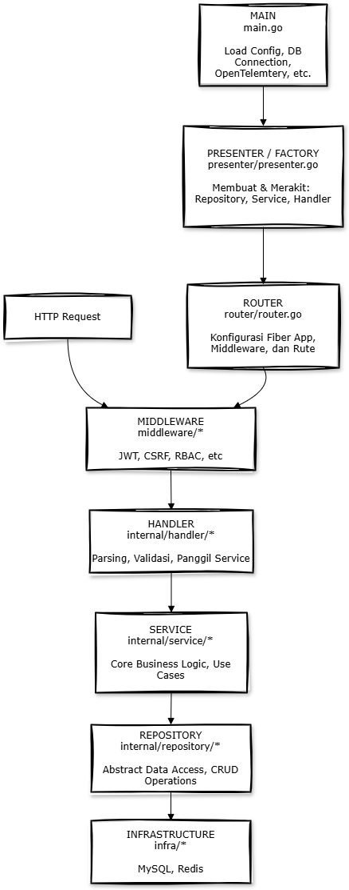

# Arsitektur Aplikasi: Clean Architecture dengan Factory Presenter

Arsitektur ini dirancang untuk mencapai **pemisahan tanggung jawab (separation of concerns)** yang kuat. Setiap lapisan memiliki satu tugas spesifik, dan dependensi mengalir ke satu arah (dari luar ke dalam), membuat sistem lebih mudah dipelihara dan diuji.

Alur yang Anda sebutkan (`main` -> `presenter` -> `router` -> `handler` -> `service` -> `repository`) adalah alur **inisialisasi dan eksekusi** yang sangat terstruktur.

### Diagram Arsitektur

---



---

### Penjelasan Detail per Lapisan

#### 1. Main (`main.go`)

- **Tanggung Jawab Utama**: Titik masuk (entry point) dan orkestrator startup aplikasi.
- **Detail Penjelasan**:
  - Ini adalah lapisan terluar. Tugasnya sangat sederhana dan tingkat tinggi:
    1.  Memuat konfigurasi dari file `.env` (database credentials, JWT secret, dll.).
    2.  Membuat koneksi ke infrastruktur eksternal seperti database (GORM), session store, dan layanan pihak ketiga (Cloudinary).
    3.  **Memanggil Presenter/Factory** untuk membuat dan merakit semua komponen dari sebuah modul (misalnya, modul `customer`).
    4.  **Memanggil Router** untuk mengkonfigurasi rute-rute HTTP, dengan memberikan _handler_ yang sudah jadi dari Presenter.
    5.  Menjalankan server Fiber.

#### 2. Presenter / Factory (`presenter/presenter.go`)

- **Tanggung Jawab Utama**: Menerapkan **Factory Design Pattern** untuk membuat dan menyuntikkan dependensi (_Dependency Injection_) untuk satu modul fitur secara terpusat.
- **Detail Penjelasan**:
  - Ini adalah "pabrik perakitan" untuk sebuah modul. Ia menerima "bahan mentah" seperti koneksi database (`*gorm.DB`) dan konfigurasi (`*config.Config`) dari `main`.
  - Di dalamnya, ia membuat semua objek yang dibutuhkan secara berurutan, dari lapisan terdalam ke terluar:
    1.  Membuat instance **Repository** (`New...Repository(db)`).
    2.  Membuat instance **Service**, dengan menyuntikkan (injecting) Repository ke dalamnya (`New...Service(repo)`).
    3.  Membuat instance **Handler**, dengan menyuntikkan Service ke dalamnya (`New...Handler(service)`).
  - Fungsi utamanya (`Wire()`) mengembalikan `Handler` yang sudah siap pakai dan sepenuhnya terhubung.
  - **Keuntungan**: Proses pembuatan objek yang kompleks menjadi terpusat di satu tempat, membuat `main.go` sangat bersih.

#### 3. Router (`router/router.go`)

- **Tanggung Jawab Utama**: Mengkonfigurasi endpoint HTTP, menerapkan middleware global dan grup, dan memetakan rute ke metode handler yang sesuai.
- **Detail Penjelasan**:
  - Router tidak peduli _bagaimana_ sebuah handler dibuat. Ia hanya menerima objek `Handler` yang sudah jadi dari `main`.
  - Tugasnya murni konfigurasi:
    1.  Menerapkan middleware level aplikasi (misalnya, `logger`).
    2.  Membuat grup rute (misalnya, `/api/v1/admin`, `/api/v1/me`).
    3.  Menerapkan middleware level grup (misalnya, `jwtAuth`, `customCSRF`, `requireAdmin`).
    4.  Mendefinisikan rute spesifik (`app.Post("/register", ...)`) dan menautkannya ke metode handler (`profileHandler.Register`).

#### 4. Handler (`internal/handler/*`)

- **Tanggung Jawab Utama**: Menjadi perantara antara dunia HTTP dan logika bisnis aplikasi.
- **Detail Penjelasan**:
  - Menerima request HTTP dari Router.
  - Membaca dan mem-parsing data dari request (body, parameter URL, query string, header).
  - Melakukan validasi input (misalnya, menggunakan DTO dan `validator`).
  - Memanggil metode yang sesuai di **Service** dengan data yang sudah bersih.
  - Menerima hasil atau error dari Service.
  - Memformat respons HTTP (menyetel status code dan mengirim body JSON).
  - **Tidak boleh mengandung logika bisnis apapun.**

#### 5. Service (`internal/service/*`)

- **Tanggung Jawab Utama**: Mengeksekusi _use case_ atau logika bisnis inti.
- **Detail Penjelasan**:
  - Ini adalah jantung dari aplikasi Anda.
  - Menerima data dari Handler.
  - Mengorkestrasi satu atau lebih pemanggilan ke **Repository** untuk berinteraksi dengan data.
  - Menerapkan semua aturan bisnis (misalnya, "pengguna tidak bisa transfer melebihi saldo", "limit tidak boleh negatif").
  - Mengelola transaksi database (`tx.Begin()`, `tx.Commit()`, `tx.Rollback()`) untuk memastikan atomicity.
  - Sama sekali tidak tahu tentang HTTP. Ia bisa dipanggil oleh handler HTTP, proses background, atau CLI.

#### 6. Repository (`internal/repository/*`)

- **Tanggung Jawab Utama**: Mengabstraksi dan mengelola semua operasi akses data.
- **Detail Penjelasan**:
  - Bertindak sebagai "pintu gerbang" ke database.
  - Mengimplementasikan interface yang didefinisikan di lapisan domain.
  - Menerjemahkan pemanggilan metode (seperti `Create`, `FindByID`) menjadi query database spesifik (misalnya, query GORM).
  - Mengisolasi seluruh aplikasi dari detail implementasi database. Jika Anda ingin beralih dari MySQL ke PostgreSQL, Anda hanya perlu mengubah lapisan ini.

---

# Alur Aplikasi Lengkap: Dari Registrasi hingga Transaksi dengan Validasi Limit

Alur ini menjelaskan perjalanan lengkap seorang pengguna, mulai dari tidak memiliki akun hingga berhasil menyelesaikan transaksi, termasuk langkah validasi limit sebelum transaksi final.

### Aktor dalam Alur Ini:
*   **Calon Pengguna**: Seseorang yang belum terdaftar.
*   **Admin / Analis Kredit**: Karyawan internal PT XYZ.
*   **Pengguna Terverifikasi**: Pengguna yang telah login ke dalam sistem.

---

### Tahap 1: Pendaftaran & Verifikasi Awal

*Tujuan: Membuat data pengguna baru dengan status menunggu verifikasi dari admin.*

1.  **Aksi Klien (Calon Pengguna)**: Mengakses aplikasi, mendapatkan token CSRF, dan mengirim data pendaftaran melalui `POST /api/v1/auth/register`.
2.  **Proses di Server**: `ProfileService` membuat record baru dengan `verification_status` = **`PENDING`**.
3.  **Hasil**: Pengguna mendapat pesan "Registrasi berhasil, silakan tunggu verifikasi." dan **belum bisa login**.

---

### Tahap 2: Proses Internal Admin (Verifikasi & Penetapan Limit)

*Tujuan: Mengaktifkan akun pengguna dan memberikannya daya pinjam.*

1.  **Aksi Klien (Admin / Analis Kredit)**:
    *   **Verifikasi Akun**: Admin menyetujui pengguna melalui `POST /api/v1/admin/customers/{id_pengguna}/verify`.
    *   **Penetapan Limit**: Analis Kredit menetapkan limit melalui `POST /api/v1/admin/customers/{id_pengguna}/limits`.
2.  **Proses di Server**: Status pengguna diubah menjadi **`VERIFIED`** dan data limit kredit disimpan.
3.  **Hasil**: Akun pengguna sekarang **aktif** dan **memiliki limit kredit**.

---

### Tahap 3: Login Pengguna & Persiapan Sesi

*Tujuan: Mengotentikasi pengguna dan mempersiapkan sesi yang aman untuk transaksi.*

1.  **Aksi Klien (Pengguna Terverifikasi)**: Pengguna melakukan login melalui `POST /api/v1/auth/login`.
2.  **Proses di Server**: `PrivateService` memvalidasi kredensial dan status. Server menyetel **cookie `HttpOnly`** berisi JWT dan mengirim **token CSRF baru** di body JSON.
3.  **Hasil**: Pengguna berhasil login. Frontend menyimpan token CSRF yang baru.

---

### Tahap 4: Pengecekan Limit Pra-Transaksi (Langkah Baru)

*Tujuan: Memastikan pengguna memiliki limit yang cukup **sebelum** menampilkan tombol konfirmasi akhir, untuk memberikan pengalaman pengguna yang lebih baik.*

1.  **Aksi Klien (Pengguna Terverifikasi)**:
    *   Pengguna berada di halaman pembayaran, telah memilih barang dan tenor.
    *   **Sebelum** tombol "Bayar Sekarang" diaktifkan, frontend secara otomatis di latar belakang memanggil endpoint `check-limit`. Ini adalah validasi awal yang tidak terlihat oleh pengguna.

    **Contoh Request:**
    *   **Endpoint**: `POST /api/v1/partners/check-limit`
    *   **Header**: `X-CSRF-Token: <token_csrf_dari_respons_login>`
    *   **Body**:
        ```json
        {
          "tenor_months": 6,
          "transaction_amount": 35750000 
        }
        ```
        *(Catatan: `transaction_amount` adalah `otr_amount` + `admin_fee`)*

2.  **Proses di Server**:
    *   Request melewati pipeline middleware (JWT, CSRF, RBAC).
    *   `PartnerService` dipanggil:
        *   Mengambil `customer_id` dari konteks JWT.
        *   Melakukan operasi **baca (read-only)** untuk menghitung sisa limit (`Total Limit` - `Total Transaksi Aktif`).
        *   Membandingkan sisa limit dengan `transaction_amount` dari request.
        *   Mengembalikan respons `approved` atau `rejected`.

3.  **Hasil**:
    *   **Jika `approved`**: Frontend menerima respons positif, lalu mengaktifkan tombol "Bayar Sekarang" dan mungkin menampilkan pesan "Limit Anda cukup. Lanjutkan pembayaran?".
    *   **Jika `rejected`**: Frontend menerima respons negatif, menampilkan pesan error "Maaf, sisa limit Anda tidak mencukupi untuk transaksi ini," dan tombol "Bayar Sekarang" tetap non-aktif.

---

### Tahap 5: Pembuatan Transaksi Final

*Tujuan: Pengguna yang sudah divalidasi limitnya melakukan komitmen akhir untuk membuat transaksi.*

1.  **Aksi Klien**:
    *   Karena `check-limit` berhasil, pengguna kini menekan tombol "Bayar Sekarang".
    *   Frontend memanggil `POST /api/v1/partners/transactions`.

    **Contoh Request:**
    *   **Header**: `X-CSRF-Token: <token_csrf_yang_sama>`
    *   **Body**:
        ```json
        {
          "tenor_months": 6,
          "asset_name": "Motor Yamaha NMAX",
          "otr_amount": 35000000,
          "admin_fee": 750000
        }
        ```
2.  **Proses di Server (`TransactionService`)**:
    a.  Memulai **DATABASE TRANSACTION**.
    b.  Mengambil `customer_id` dari konteks JWT.
    c.  **Mengunci baris data customer** (`SELECT ... FOR UPDATE`).
    d.  **Melakukan validasi ulang limit**. Ini adalah *validasi krusial kedua* untuk mencegah *race conditions* (jika pengguna mencoba transaksi lain secara bersamaan di tab berbeda).
    e.  Jika validasi ulang gagal, `ROLLBACK` dan kembalikan error.
    f.  Jika berhasil, buat record baru di tabel `transactions`.
    g.  **COMMIT** transaksi database.

---

### Tahap 6: Konfirmasi & Hasil Akhir

1.  **Proses di Server**: Mengembalikan respons `201 Created` dengan detail transaksi.
2.  **Aksi Klien**: Menampilkan halaman "Transaksi Berhasil".
3.  **Hasil**: Transaksi baru tercatat, dan limit kredit pengguna telah berkurang secara akurat dan aman.

---

### Diagram Alur Konseptual


---
